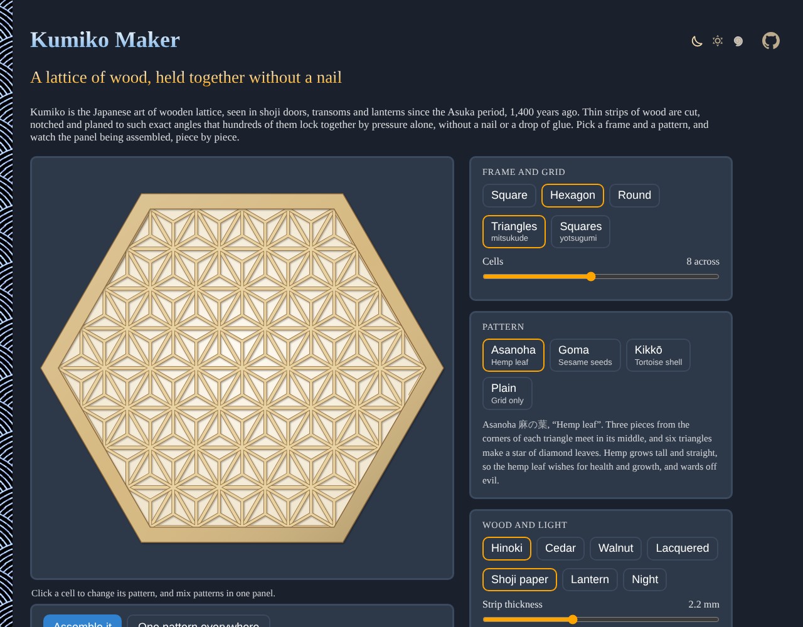
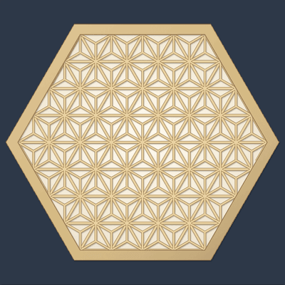
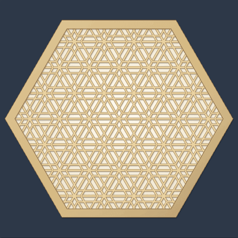
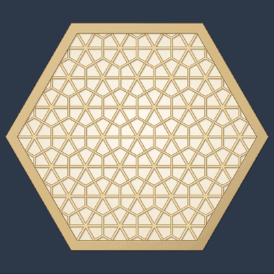
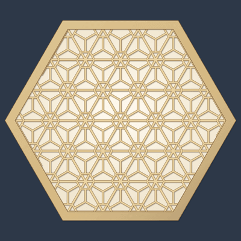
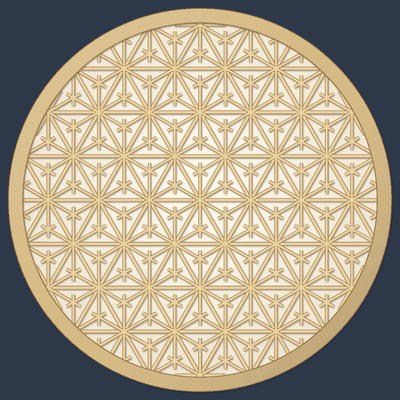
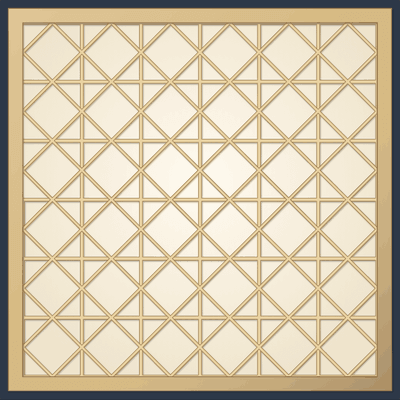
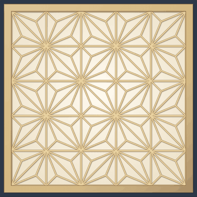
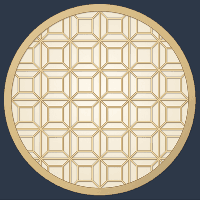

# Kumiko-Maker

Design a kumiko panel right in your browser: the Japanese wooden lattice of shoji doors and lanterns, with asanoha, goma, kikkō, tsuno-asanoha and sakura patterns in a square, hexagonal or round frame. Watch it being assembled piece by piece, mix patterns cell by cell, and save it as an SVG or a PNG. No sign-up and no libraries.

- [Make a kumiko panel](https://evoluteur.github.io/kumiko-maker/)

## What it does

Kumiko pieces are cut, notched and planed so precisely that hundreds of them lock together without nails or glue.

- **Frame**: square, hexagon or round.
- **Grid** (*jigumi*): triangles (*mitsukude*) or squares, from 3 to 14 cells across.
- **Patterns** (*tsukeko*): asanoha (hemp leaf), goma (sesame seeds), kikkō (tortoise shell), tsuno-asanoha (horned hemp leaf) and sakura (cherry blossom) on the triangle grid; kaku-asanoha (square hemp leaf), izutsu-tsunagi (well frames) and hishi (diamonds) on the square grid.
- **Click a cell** to change its pattern, and mix patterns in one panel.
- **Assemble it**: the frame, then the grid strips family by family, then the infill pieces from the middle out.
- **Wood and light**: hinoki, cedar, walnut or lacquered black, in front of shoji paper, a lantern or the night.
- **Counts**: grid strips, half-lap joints, infill pieces, and the length of wood for a 30 cm panel.
- **Save**: **Download PNG** (2000 pixels square) or **Download SVG**. The address of the page keeps the panel, to share it.

## Patterns

On the triangle grid (top two rows) and the square grid (bottom row). Click a pattern to open it in the app.

<table>
<tr valign="top"><td align="center"> <b>Asanoha</b> 麻の葉 Hemp leaf</td><td align="center"> <b>Goma</b> 胡麻 Sesame seeds</td><td align="center"> <b>Kikkō</b> 亀甲 Tortoise shell</td></tr>
<tr valign="top"><td align="center"> <b>Sakura</b> 桜 Cherry blossom</td><td align="center"> <b>Tsuno-asanoha</b> つの麻の葉 Horned hemp leaf</td><td align="center"> <b>Hishi</b> 菱 Diamonds</td></tr>
<tr valign="top"><td align="center"> <b>Kaku-asanoha</b> 角麻の葉 Square hemp leaf</td><td align="center"> <b>Izutsu-tsunagi</b> 井筒つなぎ Linked well frames</td><td></td></tr>
</table>

## How it works

The grid strips are long lines clipped to the frame opening (a convex polygon or a circle). Each cell then gets its pieces: three pieces from the corners to the center for asanoha, three pieces running alongside the sides for goma, three pieces from the center to the middle of the sides for kikkō, three pieces across the corners and three from the center to them for sakura, and so on. Pieces are drawn as strips of wood with a darker edge, the grid first, so its crossings look flush like real half-lap joints.

## How it is built

Plain HTML, CSS and JavaScript, with no dependencies and no build step. Just open `index.html`. It is also a small installable web app that works offline.

- The whole thing is in `js/kumiko.js` ([source](https://github.com/evoluteur/kumiko-maker/blob/main/js/kumiko.js)).
- The three color themes (dark, light and blue) are shared with my other projects, copied from [omg-themes](https://github.com/evoluteur/omg-themes) (`npm run sync:themes` refreshes them).

Kumiko-Maker is open source at [GitHub](https://github.com/evoluteur/kumiko-maker) with MIT license.

Had fun browsing the app? [Buy me a coffee by becoming a sponsor](https://github.com/sponsors/evoluteur).

You may also be interested in [Sashiko-Maker](https://github.com/evoluteur/sashiko-maker) ([demo](https://evoluteur.github.io/sashiko-maker/)), [Islamic-Patterns](https://github.com/evoluteur/islamic-patterns) ([demo](https://evoluteur.github.io/islamic-patterns/)) and [Rose-Window-Maker](https://github.com/evoluteur/rose-window-maker) ([demo](https://evoluteur.github.io/rose-window-maker/)). For more mystic arts as small web apps, see [Esoterica](https://evoluteur.github.io/esoterica.html).

Copyright (c) 2026 [Olivier Giulieri](https://evoluteur.github.io/).
